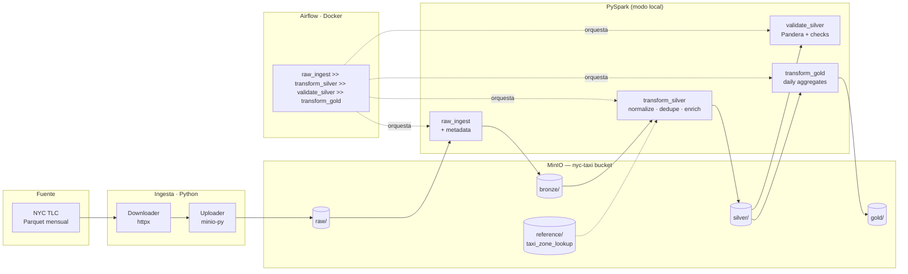

# NYC Taxi Lakehouse

Un data lakehouse local que construí de punta a punta: ingesta, transformación con Spark, validación de calidad de datos y orquestación con Airflow, todo containerizado con Docker.

Seguí como referencia una guía de aprendizaje de 7 pasos para lakehouses (dataset → entorno → raw → transform → Airflow → data quality → tabla analítica final), pero fui ampliándola con mis propias decisiones de diseño a medida que avanzaba: terminé con una arquitectura Medallion de 4 capas (raw/bronze/silver/gold) en lugar de 3, idempotencia en cada etapa, y una capa de calidad de datos separada de la transformación.

**Autor:** Michael Espinosa · [LinkedIn](https://www.linkedin.com/in/michael-espinosa-dev/)

---

## Arquitectura



### Las 4 capas

| Capa | Contenido | Qué hace |
|---|---|---|
| **raw** | Parquet original, sin tocar | Ingesta cruda desde la fuente, particionado por `year=/month=` |
| **bronze** | Igual a raw + metadata | Le agrego `ingestion_timestamp` y `source_file` para trazabilidad |
| **silver** | Datos limpios y conformados | Normalizo el schema (nombres y tipos consistentes entre años), deduplico, enriquezco con zonas geográficas |
| **gold** | Agregados diarios | Totales por día, tarifa promedio, distancia promedio, rolling average de 7 días |

Diseñé cada capa para que sea **idempotente**: antes de procesar un dataset, verifico si su marcador `_SUCCESS` ya existe en el destino, y si es así, lo salto. Esto me permite re-ejecutar el pipeline completo sin duplicar trabajo ni datos.

---

## Stack

| Categoría | Tecnología |
|---|---|
| Lenguaje | Python 3.12 |
| Gestor de paquetes | [uv](https://docs.astral.sh/uv/) |
| Procesamiento de datos | PySpark 4.2.0 (modo local, un solo nodo) |
| Object storage | MinIO (S3-compatible) |
| Orquestación | Apache Airflow 3.2.2 (LocalExecutor) |
| Calidad de datos | Pandera (backend PySpark) |
| Configuración | Pydantic Settings |
| Logging estructurado | structlog |
| Descarga HTTP | httpx |
| Contenedores | Docker Compose |

---

## Estructura del proyecto

```
nyc-taxi-lakehouse/
├── dags/                          # DAG de Airflow
├── docker/airflow/                # Dockerfile custom (Java + proyecto instalado)
├── notebooks/                     # Exploración de datos y desarrollo iterativo
├── src/nyc_taxi_lakehouse/
│   ├── config/                    # Settings (Pydantic) y logging
│   ├── download/                  # Cliente HTTP + manifest de datasets
│   ├── storage/                   # Cliente MinIO (bucket/objeto idempotente)
│   └── spark/
│       ├── jobs/                  # raw_ingest, transform_silver, validate_silver, transform_gold
│       ├── transformations/       # Lógica pura: normalización de schema, enrichment, agregaciones
│       ├── quality/                # Validación de silver con Pandera
│       ├── session.py             # Factory de SparkSession (config S3A/MinIO)
│       └── main_*.py              # Entrypoints batch por capa
├── main.py                        # Entrypoint de la fase de ingesta (raw)
└── docker-compose.yml             # MinIO + Airflow (Postgres, scheduler, api-server, etc.)
```

---

## Cómo correrlo

### 1. Variables de entorno

```bash
cp .env.example .env
```

### 2. Levantar la infraestructura

```bash
docker compose up -d
```

Esto levanta MinIO (`localhost:9001` consola web) y el stack completo de Airflow (`localhost:8080`).

Airflow usa el **Simple Auth Manager** — la contraseña del usuario `admin` se autogenera en cada `airflow-init`. La recupero con:

```bash
docker compose logs airflow-api-server | grep -i password
```

### 3. Sincronizar dependencias locales (para desarrollo/notebooks)

```bash
uv sync
```

### 4. Subir la tabla de referencia de zonas

Subo `taxi_zone_lookup.csv` a `nyc-taxi/reference/` en MinIO (vía la consola web o `mc`).

### 5. Correr el pipeline

**Manual, capa por capa:**

```bash
uv run python -m nyc_taxi_lakehouse.main                          # descarga + sube a raw
uv run python -m nyc_taxi_lakehouse.spark.main_raw_ingest          # raw -> bronze
uv run python -m nyc_taxi_lakehouse.spark.main_transform_silver    # bronze -> silver
uv run python -m nyc_taxi_lakehouse.spark.main_validate_silver     # calidad de datos sobre silver
uv run python -m nyc_taxi_lakehouse.spark.main_transform_gold      # silver -> gold
```

**Orquestado con Airflow:** activo el DAG `nyc_taxi_pipeline` desde la UI o:

```bash
docker compose exec airflow-scheduler airflow dags unpause nyc_taxi_pipeline
docker compose exec airflow-scheduler airflow dags trigger nyc_taxi_pipeline
```

---

## Decisiones de diseño que tomé

- **4 capas en vez de 3.** La guía original propone raw → clean → analytics. Decidí separar silver (grano de fila, limpio y conformado) de gold (grano agregado), porque son responsabilidades distintas que quería poder evolucionar y re-ejecutar por separado.
- **Un bucket, no cuatro.** Terminé usando `nyc-taxi/{raw,bronze,silver,gold,reference}/` en vez de un bucket por capa, con prefijos jerárquicos — lo cambié a mitad de camino cuando me di cuenta de que era más coherente con el proyecto.
- **Idempotencia en cada etapa.** Agregué verificación de `_SUCCESS`/existencia de objeto antes de reprocesar, en ingesta, transformación y agregación.
- **Validación de calidad separada de la transformación.** `validate_silver` es una task independiente que informa (no bloquea) el pipeline; documento los hallazgos reales en [`docs/lessons-learned.md`](docs/lessons-learned.md).

En ese mismo documento cuento con más detalle los problemas que me encontré construyendo esto — de datos y de infraestructura — y cómo los resolví.

---

## Licencia

MIT